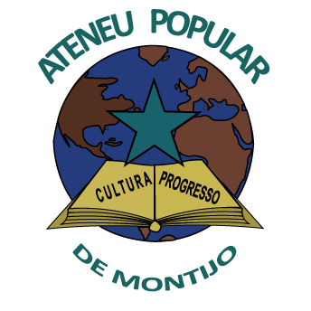

<!--
  NOTA DE DESENVOLVIMENTO:
  Este ficheiro é gerado para GitHub Pages (Jekyll).
  Para personalizar o visual, cria um ficheiro _config.yml e adiciona um tema (ex: minima, cayman).
  Para estilos avançados, cria assets/css/style.scss e sobrepõe as regras do tema.
-->

---

# Ateneu Popular do Montijo

### *Cultura, Educação e Comunidade em Montijo*

<a href="#sobre" style="display:inline-block;padding:8px 18px;margin:4px;background:#2c3e50;color:#fff;text-decoration:none;border-radius:25px;font-size:14px;">Sobre</a>
<a href="#atividades-e-eventos" style="display:inline-block;padding:8px 18px;margin:4px;background:#2c3e50;color:#fff;text-decoration:none;border-radius:25px;font-size:14px;">Atividades</a>
<a href="#calendário" style="display:inline-block;padding:8px 18px;margin:4px;background:#2c3e50;color:#fff;text-decoration:none;border-radius:25px;font-size:14px;">Calendário</a>
<a href="#redes-sociais" style="display:inline-block;padding:8px 18px;margin:4px;background:#2c3e50;color:#fff;text-decoration:none;border-radius:25px;font-size:14px;">Redes Sociais</a>
<a href="#contactos" style="display:inline-block;padding:8px 18px;margin:4px;background:#2c3e50;color:#fff;text-decoration:none;border-radius:25px;font-size:14px;">Contactos</a>

---

## Sobre

O **Ateneu Popular do Montijo** é uma associação cultural sem fins lucrativos fundada a 15 de dezembro de 1939. Ao longo de mais de oito décadas, tem sido um espaço de encontro, aprendizagem e partilha para gerações de montijenses, fiel a uma matriz humanista e libertária. Em 2024 foi distinguido com a Medalha de Ouro da Cidade do Montijo.

### A Nossa Missão

> *"Promover o acesso democrático à cultura, ao saber e à expressão artística, enraizados numa tradição humanista e libertária que nos guia desde 1939."*

### Os Nossos Valores

| Valor | Descrição |
|---|---|
| **Cultura** | Valorizamos a expressão artística e o património local |
| **Educação** | Acreditamos no poder transformador do conhecimento |
| **Comunidade** | Colocamos as pessoas no centro de tudo o que fazemos |
| **Inclusão** | Abrimos as nossas portas a todos, sem exceção |
| **Participação** | Incentivamos o envolvimento ativo de todos os membros |

### Objetivos

- Dinamizar atividades culturais, educativas e recreativas acessíveis a toda a comunidade
- Preservar e divulgar o património histórico e cultural de Montijo
- Fomentar o debate de ideias e o pensamento crítico
- Apoiar iniciativas de cidadania ativa e solidariedade
- Criar pontes entre gerações, saberes e culturas

---

## Atividades e Eventos

#### Xadrez

- **Escola de Xadrez** — Aulas gratuitas de iniciação e formação avançada, aos sábados. Abertas à comunidade, orientadas por treinadores certificados pela Federação Portuguesa de Xadrez.
- **Competições oficiais** — O Ateneu compete na 2.ª Divisão Nacional e nos Campeonatos Distritais da Associação de Xadrez de Setúbal.
- **Open de Xadrez** — Torneio anual em formato de partidas rápidas, organizado em parceria com as Festas de S. Pedro.
- **Xadrez nas escolas** — Parcerias com escolas e ATLs para ensino da modalidade.

#### Melomania

- **Sessões mensais de escuta** — Geralmente às sextas-feiras às 21h30. As luzes apagam-se, ouve-se um disco completo sem interrupções e conversa-se sobre a obra. Entrada gratuita, M/6 anos.
- Iniciativa em parceria com a Companhia Mascarenhas-Martins, com mais de 20 edições realizadas desde 2023.

#### TertuLERia

- **Último domingo de cada mês**, das 16h00 às 18h00, na sede do Ateneu.
- Espaço aberto à leitura partilhada de poesia, prosa e outros textos. Cada participante traz e lê um texto à escolha. Aberto a todas as idades.

#### Jogos

- **Jogos de Tabuleiro** — Sessões regulares na sede do Ateneu. Jogos disponibilizados pelo grupo; podes também trazer os teus.
  - Comunidade aberta a todos os níveis, de principiantes a veteranos.
- **Domingos de Wargames** — Jogos de estratégia de miniaturas.
  - Segundo domingo de cada mês, das 14h30 às 19h30.

#### Fotografia

- **Exposições fotográficas** — O núcleo de fotografia organiza exposições regulares, com destaque para "Retratos do Cante", uma homenagem ao Cante Alentejano como Património Imaterial da UNESCO.
- **Cursos** — Curso de Iniciação à Fotografia Digital com inscrição simbólica.

---

---

## Calendário

### Agenda do Ateneu

<iframe src="https://teamup.com/ksvz9wuscgj5mhss1d?view=ti&tz=Calendar%20default&showHeader=0&showProfileAndInfo=0&showSidepanel=0&showViewSelector=1&showMenu=0&showViewHeader=1&showAgendaDetails=1&showDateControls=1&showDateRange=1" style="border: 1px solid #cccccc; width: 100%; height: 600px;" frameborder="0" scrolling="auto"></iframe>

---

## Redes Sociais

Segue-nos no Facebook e fica a par de todas as novidades, eventos e iniciativas do Ateneu Popular do Montijo!

**[🔵 Facebook — Ateneu Popular do Montijo](https://www.facebook.com/AteneuPopularMontijo/)**
Acompanha publicações, eventos e novidades no dia a dia.
> *[→ Seguir no Facebook](https://www.facebook.com/AteneuPopularMontijo/)*

**[💬 WhatsApp — Grupo do Ateneu Popular do Montijo](https://chat.whatsapp.com/F6TC578kGVmB1zUt1PfHM0)**
Junta-te ao nosso grupo e fica a par de todas as novidades em tempo real.
> *[→ Entrar no grupo WhatsApp](https://chat.whatsapp.com/F6TC578kGVmB1zUt1PfHM0)*

---

## Contactos

### Como nos encontrar

**Morada:**
Ateneu Popular do Montijo
Rua Luis Calado Nunes (Patio Aldegalega) Loja H
2870-350 Montijo, Portugal

---

**Email:**
[ateneu.popular.montijo@gmail.com](mailto:ateneu.popular.montijo@gmail.com)

---

**Telefone:**
[21 231 5260](tel:+351212315260)

---

**WhatsApp:**
[→ Entrar no grupo](https://chat.whatsapp.com/F6TC578kGVmB1zUt1PfHM0)

---

### Localização

<iframe src="https://www.google.com/maps/embed?pb=!1m18!1m12!1m3!1d3118.5!2d-8.9736!3d38.7057!2m3!1f0!2f0!3f0!3m2!1i1024!2i768!4f13.1!3m3!1m2!1s0x0%3A0x0!2sRua+Luis+Calado+Nunes%2C+Montijo!5e0!3m2!1spt-PT!2spt!4v1" width="100%" height="400" style="border:0;" allowfullscreen="" loading="lazy"></iframe>

---

## Associa-te

Queres fazer parte da nossa comunidade?
Torna-te membro do Ateneu Popular do Montijo e apoia a cultura e a educação em Montijo!

**[→ Saber mais sobre como associar-se](mailto:ateneu.popular.montijo@gmail.com)**

> *A quota de associação é simbólica e permite-te participar em todas as atividades com condições especiais.*

---

---

## Ateneu Popular do Montijo

*Cultura, Educação e Comunidade em Montijo*

[Sobre](#sobre) · [Atividades](#atividades-e-eventos) · [Calendário](#calendário) · [Redes Sociais](#redes-sociais) · [Contactos](#contactos)

---

© 2026 Ateneu Popular do Montijo. Todos os direitos reservados.

*Associação Cultural sem Fins Lucrativos · Montijo, Portugal*

